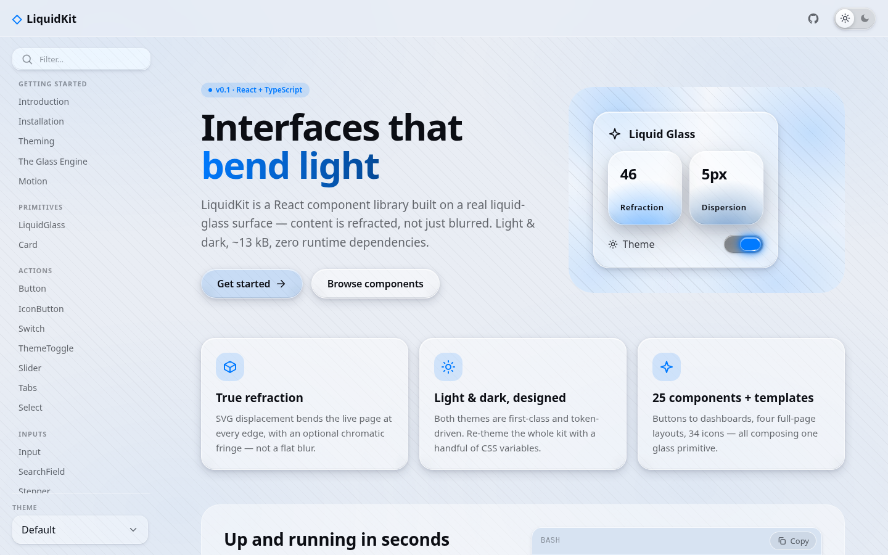
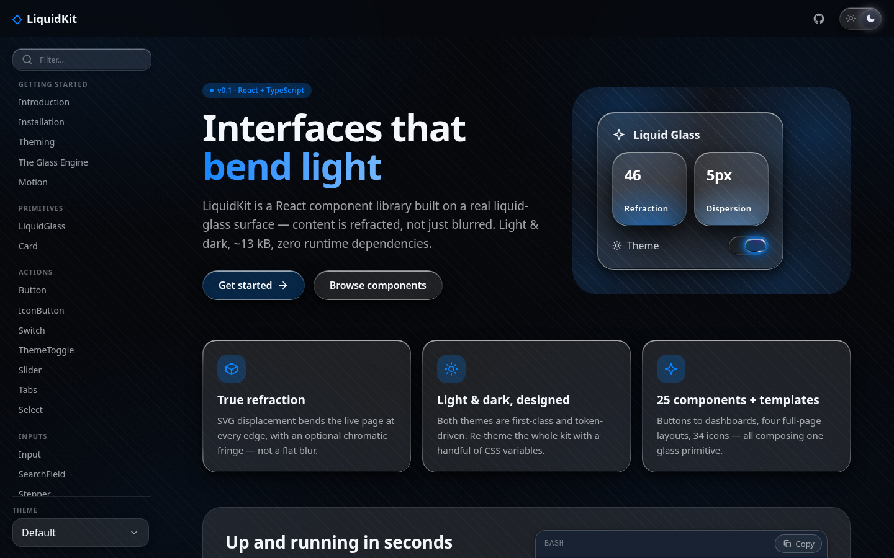
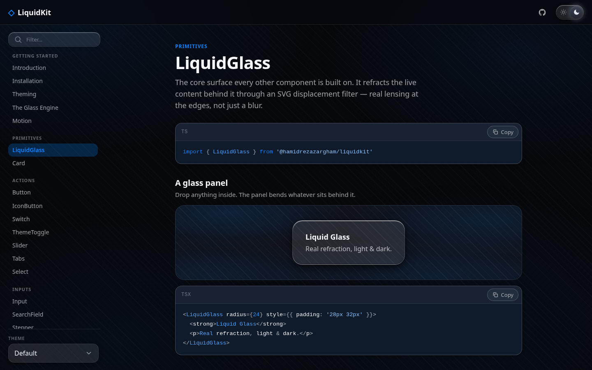
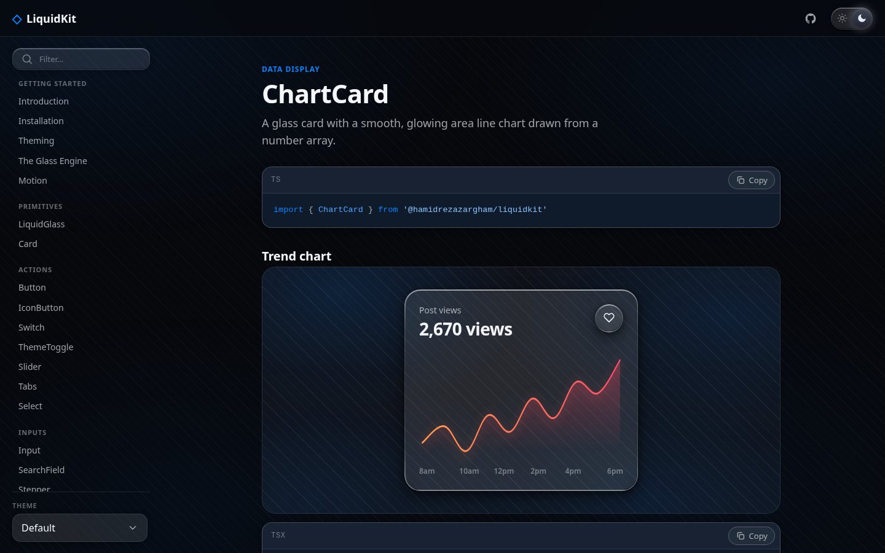
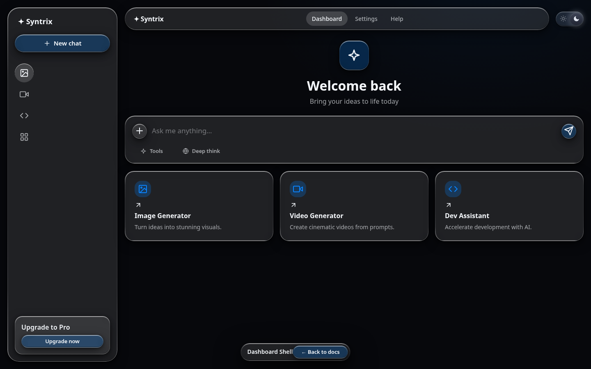
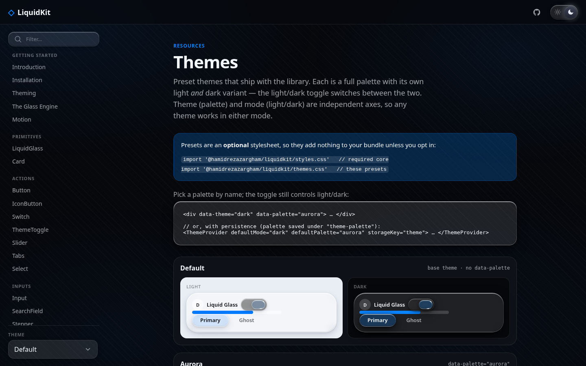

<div align="center">

# LiquidKit

[](https://github.com/hamidrezazargham/liquidkit/actions/workflows/ci.yml)
[](https://www.npmjs.com/package/@hamidrezazargham/liquidkit)
[](./LICENSE)


**A React + TypeScript _Liquid Glass_ UI library — real edge refraction, chromatic dispersion, and first-class light & dark themes.**

[**Live demo ↗**](https://hamidrezazargham.github.io/liquidkit/) &nbsp;·&nbsp; [**Documentation**](https://hamidrezazargham.github.io/liquidkit/) &nbsp;·&nbsp; [**npm**](https://www.npmjs.com/package/@hamidrezazargham/liquidkit)

</div>

<table>
  <tr>
    <td width="50%"></td>
    <td width="50%"></td>
  </tr>
</table>

LiquidKit isn't "glassmorphism" (a blur and a border). Every surface runs a real-time **SVG displacement engine** that bends the content behind it like actual glass, with optional chromatic dispersion for that rainbow edge fringe. It gracefully degrades to a frosted blur where the engine isn't supported.

```tsx
import { ThemeProvider, Button, Card } from '@hamidrezazargham/liquidkit'
import '@hamidrezazargham/liquidkit/styles.css'

export default function App() {
  return (
    <ThemeProvider defaultMode="dark">
      <Card>
        <h2>Liquid Glass</h2>
        <Button variant="accent" pill>
          Get started
        </Button>
      </Card>
    </ThemeProvider>
  )
}
```

## ✨ Features

- 🔮 **True refraction, not a blur** — a real-time SVG `feDisplacementMap` bends the live backdrop at every edge, with optional **chromatic dispersion** for a rainbow fringe and specular bevels.
- 🌗 **Light & dark, first-class** — both themes are designed and token-driven; flip the whole kit with one attribute.
- 🎨 **6 preset palettes** — `aurora`, `indigo`, `orchid`, `amber`, `glacier`, `rose`, each with light _and_ dark. Palette and mode are **independent axes**.
- 🧩 **35+ components** across seven categories, plus page templates and 45 icons — all composing one `<LiquidGlass>` primitive.
- ♿ **Accessible by default** — keyboard nav, focus trapping, correct ARIA roles, and `prefers-reduced-motion` respected throughout.
- 📦 **Zero runtime dependencies** — ships TypeScript types, ESM + CJS, `ref` forwarding and DOM prop spread on every component.

## 📸 Showcase

**The core — real lensing at the edges, not a flat blur:**



<table>
  <tr>
    <td width="50%">
      <br/>
      <sub><b>35+ components</b> — data display, inputs, navigation, overlays…</sub>
    </td>
    <td width="50%">
      <br/>
      <sub><b>Full-page templates</b> — dashboards, landing, pricing & more.</sub>
    </td>
  </tr>
</table>

> Explore it all live at **[hamidrezazargham.github.io/liquidkit](https://hamidrezazargham.github.io/liquidkit/)** — every component over a refractive backdrop, in both themes.

## 🚀 Quick start

```bash
npm install @hamidrezazargham/liquidkit
# peer deps: react >= 18, react-dom >= 18
```

Import the stylesheet once (it ships the design tokens + component CSS):

```ts
import '@hamidrezazargham/liquidkit/styles.css'
```

**Next.js / React Server Components.** The library is shipped as a client module (`"use client"`), so you can import components directly into App Router pages — render them inside client components as usual. Import `@hamidrezazargham/liquidkit/styles.css` once in your root layout.

## 🎨 Theming

LiquidKit is driven by CSS custom properties. Light is the default; `[data-theme="dark"]` overrides it; with no attribute set it follows the OS.

**With the provider** (recommended — gives you `useTheme`):

```tsx
import { ThemeProvider, useTheme, ThemeToggle } from '@hamidrezazargham/liquidkit'

<ThemeProvider defaultMode="system" storageKey="theme">
  <ThemeToggle />            {/* pre-wired light/dark switch */}
</ThemeProvider>

function ThemeName() {
  const { theme, setMode, toggle } = useTheme()
  return <button onClick={toggle}>{theme}</button>
}
```

**Without the provider** — just set the attribute yourself:

```html
<html data-theme="dark"></html>
```

**Customize** any token in your own CSS:

```css
:root {
  --lk-accent: #ff5a5f;
  --lk-radius-lg: 28px;
  --lk-glass-blur: 10px;
  --lk-refract: 60; /* refraction strength */
  --lk-dispersion: 8; /* chromatic split     */
}
```

### Preset themes

The library ships named **palette** themes — each a full look (colors + glass material) with its own **light _and_ dark** variant. Theme and mode are independent axes: `data-palette` picks the palette, `data-theme` (the toggle) picks light/dark, so any theme works in either mode.



They live in an **optional** stylesheet, so they cost nothing unless you opt in:

```js
import '@hamidrezazargham/liquidkit/styles.css' // required core
import '@hamidrezazargham/liquidkit/themes.css' // adds the presets
```

Pick a palette by name — directly, or through the provider (the toggle still flips light/dark):

```jsx
<div data-theme="dark" data-palette="aurora"> … </div>

<ThemeProvider defaultMode="dark" defaultPalette="aurora" storageKey="theme"> … </ThemeProvider>
```

Built in: `aurora`, `indigo`, `orchid`, `amber`, `glacier`, `rose`. The list is exported so you can build a theme picker:

```jsx
import { themePresets } from '@hamidrezazargham/liquidkit' // [{ name, label }, …]
```

### Raw palette swatches

Need a single color rather than a whole theme? The named swatches behind each preset are exposed on their own — as a JS value and a CSS variable. These are **raw** colors (not the semantic `--lk-accent` / `--lk-bg` tokens), handy for building your own surfaces:

```js
import { palettes } from '@hamidrezazargham/liquidkit'
palettes.amber.flameAmber // '#F78358'
```

```js
import '@hamidrezazargham/liquidkit/palettes.css' // optional, opt-in

/* .promo { background: var(--lk-amber-flame-amber); } */
```

Swatches are grouped by palette and the palette name is never repeated, so `amber-taupe` is `palettes.amber.taupe` / `--lk-amber-taupe`, while `flame-amber` is `palettes.amber.flameAmber` / `--lk-amber-flame-amber`. `aurora` merges its three source groups (Ice · Forest · Borealis) into one palette.

## 🔬 The core: `<LiquidGlass>`

Every component composes this primitive. Use it directly for custom surfaces.

```tsx
<LiquidGlass radius={24} refraction={50} dispersion={6} elevation={2} interactive>
  …anything…
</LiquidGlass>
```

| Prop          | Type                                                   | Default | Description                                |
| ------------- | ------------------------------------------------------ | ------- | ------------------------------------------ |
| `as`          | `ElementType`                                          | `'div'` | Element/component to render as             |
| `radius`      | `number`                                               | `22`    | Corner radius (px)                         |
| `pill`        | `boolean`                                              | `false` | Fully rounded                              |
| `blur`        | `number`                                               | token   | Backdrop blur (px)                         |
| `refraction`  | `number`                                               | `46`    | Displacement strength                      |
| `dispersion`  | `number`                                               | `5`     | Chromatic split (0 = off)                  |
| `bezel`       | `number`                                               | `14`    | Width of the refracting edge band          |
| `tint`        | `'auto' \| 'light' \| 'dark' \| 'clear' \| 'accent'`   | `'auto'`| Surface tint                               |
| `elevation`   | `0 \| 1 \| 2 \| 3`                                     | `2`     | Drop-shadow depth                          |
| `sheen`       | `boolean`                                              | `true`  | Diagonal specular streak                   |
| `glass`       | `boolean`                                              | `true`  | Enable refraction (false → frosted blur)   |
| `interactive` | `boolean`                                              | `false` | Hover/press affordance                     |

## 🧩 Components

35+ components across seven categories, all composing the `<LiquidGlass>` primitive:

**Primitives** — `LiquidGlass`, `Card`

**Actions** — `Button`, `IconButton`, `Switch`, `ThemeToggle`, `Slider`, `Tabs`, `Select`

**Inputs** — `Input`, `SearchField`, `Stepper`, `CommandBar`

**Data display** — `Badge`, `Avatar` (+ `AvatarGroup`), `Progress`, `Tooltip`, `ChartCard`, `StatTile`, `PricingCard`, `List` (+ `ListRow`), `Table`, `Tile`

**Navigation** — `NavBar`, `Dock`, `Toolbar`, `TabBar`, `Sidebar`, `NavigationBar`

**Overlays** — `Modal`, `Sheet`, `Menu`, `Popover`, `Toast` (+ `ToastProvider` / `useToast`)

**Flow** — a node-based canvas: `FlowCanvas`, `FlowNode`, `FlowEdge`, `FlowControls`, `FlowMinimap`

`Button` and `IconButton` accept an `as` prop, so they render as a link (`as="a"`) or any element while keeping the glass styling. Every component forwards `ref` and arbitrary DOM props (`id`, `data-*`, `aria-*`, handlers) to its root element.

**Icons** — 45 stroke icons (`HomeIcon`, `SearchIcon`, `PlayIcon`, …), the `createIcon()` factory, and `GlassIcon` (renders any icon inside a refractive glass tile).

**Templates** — full, prop-driven screens: `LandingHero`, `WaitlistPage`, `PricingPage`, `DashboardShell`, plus device frames `PhoneFrame` (iOS) and `MacWindow` (macOS) for mocking app screens.

```tsx
import { PricingPage } from '@hamidrezazargham/liquidkit'

<PricingPage
  title="Pricing"
  tiers={[
    { name: 'Free', price: '$0', features: ['3 projects'], ctaLabel: 'Start' },
    { name: 'Pro', price: '$19', popular: true, features: ['Unlimited', 'Priority support'] },
  ]}
/>
```

## ♿ Accessibility

- **Keyboard** — `Tabs` / `TabBar` move with arrow keys + Home/End (roving tabindex); `Menu` / `Select` open into the list and navigate with arrows, Home/End and Esc; `Switch`, `Slider` and steppers use native controls.
- **Focus management** — `Modal` and `Sheet` trap focus, set initial focus and restore it to the trigger on close; they're labelled via `aria-labelledby` and dismiss on Esc.
- **ARIA** — correct roles throughout (`dialog`, `menu` / `menuitemcheckbox`, `listbox` / `option`, `tablist` / `tab`, `switch`); `Toast` announces politely, and errors assertively (`role="alert"`).
- **Motion & focus rings** — all motion respects `prefers-reduced-motion`, and interactive surfaces show a visible focus ring.

## 🌐 Browser support

The refraction engine uses `backdrop-filter: url(#…)` with SVG `feDisplacementMap`.

| Browser                          | Refraction + dispersion | Fallback              |
| -------------------------------- | ----------------------- | --------------------- |
| Chrome / Edge / Brave (Chromium) | ✅ Full                 | —                     |
| Safari                           | ⚠️ Partial              | Frosted blur + tint   |
| Firefox                          | ⚠️ Partial              | Frosted blur + tint   |

Where the displacement filter isn't honored (Safari, Firefox), LiquidKit detects it and serves the frosted blur + tint directly — skipping the filter work those engines would only discard — so layouts never break, you just lose the lensing. Set `glass={false}` on `<LiquidGlass>` to opt out of refraction entirely.

## ⚡ Performance

The glass engine bounds its own cost automatically, with **no change to how anything looks**: surfaces scrolled out of view release their `backdrop-filter`, and filters are shared across similarly-sized surfaces. For constrained devices you can tune fidelity app-wide with an optional provider — the default is full fidelity:

```tsx
import { GlassConfigProvider } from '@hamidrezazargham/liquidkit'

// 'high' (default) keeps everything; 'balanced'/'low' trade the rainbow fringe
// (and, at 'low', some blur) for a cheaper composite. Nothing is removed unless you opt in.
<GlassConfigProvider performance="balanced">
  <App />
</GlassConfigProvider>
```

See the **Performance** guide in the docs for the full knob list.

## 🛠️ Development

```bash
npm run dev          # docs site (http://localhost:5173)
npm run build        # build the library to dist/ (ESM + CJS + types + CSS)
npm run build:docs   # build the docs site to dist-site/
npm run typecheck    # tsc --noEmit
npm test             # vitest
npm run test:coverage
npm run lint         # eslint (incl. react-hooks + jsx-a11y)
npm run format       # prettier --write
```

The docs site lives in `/docs` and dogfoods the library — it renders every component over a refractive backdrop in both themes, with live template previews at `#/preview/landing`, `#/preview/waitlist`, `#/preview/pricing`, `#/preview/dashboard`, `#/preview/ios-settings`, `#/preview/control-center`, `#/preview/lock-screen` and `#/preview/mac-settings`.

## 🤝 Contributing

Contributions are welcome — see [CONTRIBUTING.md](./CONTRIBUTING.md) for setup, project layout, and conventions, and [CHANGELOG.md](./CHANGELOG.md) for notable changes.

## 📄 License

MIT © Hamidreza Zargham
